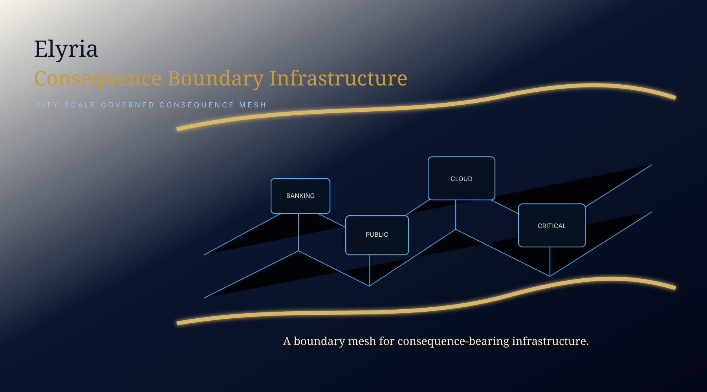

<div align="center">

# ELYRIA CONSEQUENCE-BOUNDARY INFRASTRUCTURE

### Root product category for governed runtime admission before high-risk consequence may bind

**ELYRIA SYSTEMS — VA**  
**Samantha Revita · Terry Snyder**




</div>

---

## Root product position

This repository pins the root product category:

```text
consequence-boundary infrastructure
```

All domain corridors, public proof surfaces, vertical demos, and buyer-specific artifacts are subordinate to this root product.

The vertical repos do not define separate product categories.

They show how the same root boundary architecture applies to specific consequence fields.

```text
Root product:
Elyria Consequence-Boundary Infrastructure

Vertical proof corridors:
cyber / clinical / financial / privacy / aerospace / agent continuity / commit-boundary
```

---

## Category

This repository defines the public category surface for:

```text
consequence-boundary infrastructure
```

This is not an AI wrapper.

This is not a governance dashboard.

This is not an approval workflow.

This is the infrastructure layer where high-risk proposed motion must prove standing before it becomes consequence.

---

## Core Proof Line

```text
The proof is not that a system made a decision.

The proof is that no high-risk consequence binds unless standing still holds at the boundary where effect would become real.
```

---

## Operating Invariant

```text
Nothing high-risk reaches effect unless the governed boundary resolves that it still has standing at the moment of consequence.
```

---

## Why This Exists

Large organizations already have policies, approvals, dashboards, model reviews, audit logs, and workflow routing.

Those layers do not necessarily prove that a high-risk action still has standing at the moment it reaches effect.

The hard problem is not whether something was requested, predicted, authenticated, approved, logged, or routed.

The hard problem is:

```text
At the moment this would become real, does it still have standing to bind?
```

---

## Enterprise Problem Fields

### 1. Privacy / data movement

High-risk data actions execute even when lawful basis, consent, objection, transfer approval, DPIA, processor status, or incident hold has changed.

### 2. AI deployment / model output to action

AI outputs are reviewed, logged, or approved, but the system cannot enforce whether the output may bind as action under live authority and state.

### 3. Aerospace / engineering stage admission

AI-assisted engineering formations can move from concept to simulation or review without proving safety, witness, monotonicity, or replay basis.

### 4. Enterprise access / privileged operations

Authentication proves who requested something, but not whether the action still has standing under live context, risk, authority, and continuation state.

### 5. AI memory / identity / agent continuity

Agents persist memory, intent, identity, or tool posture without a governed boundary proving continuity, coherence, standing, and replay.

---

## Canonical dependency graph

```text
Elyria Consequence-Boundary Infrastructure
  -> Universal resolving / consequence-resolution doctrine
  -> Runtime law and admissibility vocabulary
  -> Standing / authority continuity layer
  -> Domain corridor envelope
  -> Public proof surface
  -> Private production implementation
```

Layer rule:

```text
Doctrine explains the governing basis.
Registry declares the canonical surfaces.
Proof repos demonstrate bounded corridors.
Implementation remains protected unless released under controlled agreement.
```

---

## Boundary Pattern

```text
proposed motion
→ governing boundary
→ dimensional standing check
→ EXECUTE / NARROW / ESCALATE / REFUSE / HALT / REBOUND / QUARANTINE
→ physical posture
→ receipt
→ replay
→ effect only if standing holds
```

---

## Corridor Portfolio

| Corridor | Protected consequence | Public proof surface |
|---|---|---|
| National Cyber Boundary | privileged cyber action | critical-access boundary before effect |
| Clinical AI Boundary | recommendation moving toward clinical consequence | review/admissibility boundary before clinical motion |
| Financial Motion Governance | AI-assisted financial motion | value-bearing action boundary before financial effect |
| Privacy Action Custody | high-risk data action | legal standing before data effect |
| AI Output-to-Action | model output becoming action | authority/state proof before bind |
| Mission Control | engineering stage advancement | no unsafe stage admission |
| Privileged Operations | enterprise action execution | authenticated is not enough |
| Consciousness Boundary | memory / identity / agency binding | no unqualified internal formation binds |

---

## Public / Protected Boundary

Public surfaces may expose:

```text
category language
invariant language
safe surrogate examples
outcome semantics
receipt shape
replay posture
no-effect / no-advance / no-bind proof
```

Protected layers retain:

```text
private resolving machinery
client-specific law bundles
scoring laws
domain-specific policy logic
production adapters
runtime substrate
commercial corridor internals
```

---

## Public Posture

This repository is the public root product surface for Elyria Systems — VA.

It does not grant open-source rights, production deployment rights, commercial use rights, or access to protected implementation layers.
